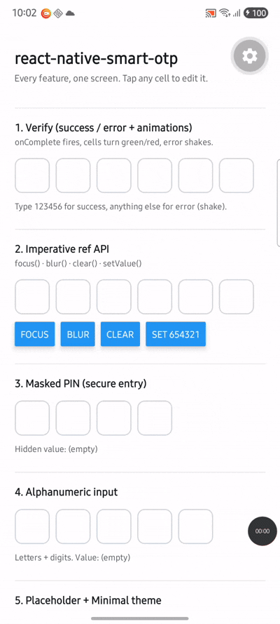
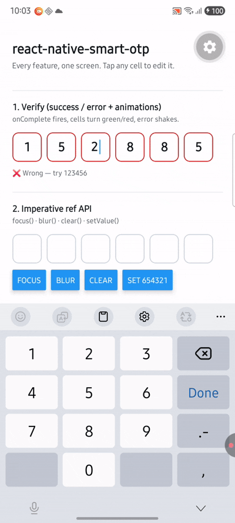
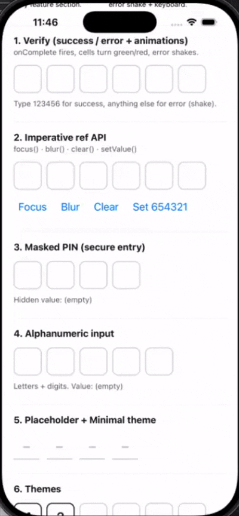
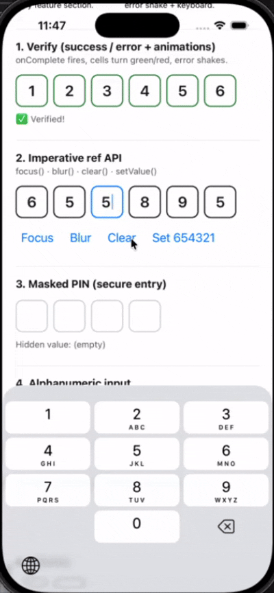

# react-native-smart-otp

[](https://github.com/bhavesh2706/smart-otp/actions/workflows/ci.yml)
[](https://www.npmjs.com/package/react-native-smart-otp)
[](.size-limit.json)
[](LICENSE)

Enterprise-grade OTP / PIN input for **React Native** and **Expo**, with platform
autofill, first-class accessibility, theming, dark mode, RTL and the New
Architecture (Fabric / TurboModules). Zero runtime dependencies; ~4.9 kB core
(~6.9 kB full public API, brotli).

## Demo

Screen recordings from the [example app](example/) (New Architecture):

### Android (physical device)

| Kitchen-sink overview | Verify flow (error shake) |
| --- | --- |
|  |  |

### iOS (simulator)

| Kitchen-sink overview | Verify success |
| --- | --- |
|  |  |

## Why

Existing OTP libraries trade off between features, accessibility and autofill.
`react-native-smart-otp` uses a **single hidden `TextInput` behind visual
cells**, so iOS `oneTimeCode` and Android `sms-otp` autofill fill every cell
atomically while screen readers focus one real, labelled field.

## Installation

```sh
npm install react-native-smart-otp
# or
yarn add react-native-smart-otp
```

`react` and `react-native` are peer dependencies. No other **required** runtime
dependencies.

| Consumer | Setup |
| --- | --- |
| **React Native CLI** | `npm install react-native-smart-otp` — the Android SMS TurboModule autolinks. Rebuild the native app after install. |
| **Expo (dev build)** | `npx expo run:android` / `run:ios` — full feature set, including Android SMS Retriever. Optionally add `{ "plugins": ["react-native-smart-otp"] }` to `app.json`. |
| **Expo Go / web** | JS-only features work (UI, themes, timer, iOS `oneTimeCode`). Android SMS and clipboard need a dev build or the optional clipboard peer (see below). Unsupported capabilities degrade gracefully — never throw. |

**Optional peer:** [`@react-native-clipboard/clipboard`](https://github.com/react-native-clipboard/clipboard)
for clipboard auto-fill (`useClipboardPaste` / `useOtpAutofill`). Install it in
your app when you want that source enabled.

**Tested with:** React 19, React Native 0.86, Expo SDK 57 (example app). New
Architecture (Fabric / TurboModules) is the primary target; the JS surface
degrades when native modules are absent.

## Quick start

```tsx
import { SmartOTPInput } from 'react-native-smart-otp';

export function VerifyScreen() {
  return (
    <SmartOTPInput length={6} autoFocus onComplete={(code) => verify(code)} />
  );
}
```

### Controlled

```tsx
const [code, setCode] = useState('');

<SmartOTPInput length={4} value={code} onChange={setCode} mask />;
```

### Imperative ref

```tsx
const ref = useRef<SmartOTPInputRef>(null);

ref.current?.focus();
ref.current?.clear();
ref.current?.setValue('123456');
```

## API

### `<SmartOTPInput />`

| Prop | Type | Default | Description |
| --- | --- | --- | --- |
| `length` | `number` | — (required) | Number of cells / expected code length. |
| `value` | `string` | — | Controlled value. Pair with `onChange`. |
| `defaultValue` | `string` | `''` | Initial value (uncontrolled only). |
| `onChange` | `(code: string) => void` | — | Fires on every sanitized change. |
| `onComplete` | `(code: string) => void` | — | Fires once when the last cell fills. |
| `autoFocus` | `boolean` | `false` | Focus on mount. |
| `mask` | `boolean` | `false` | Visually mask entered characters. |
| `maskSymbol` | `string` | `'●'` | Glyph used while masking. |
| `type` | `'numeric' \| 'alphanumeric'` | `'numeric'` | Accepted character set. |
| `disabled` | `boolean` | `false` | Disable input and dim cells. |
| `editableCells` | `boolean` | `true` | Tap any cell to edit that digit. Middle deletes leave a positional "hole" (a space in `value`) until refilled; use `stripHoles(value)` for the compact code. |
| `error` | `boolean` | `false` | Render cells in the error state. |
| `success` | `boolean` | `false` | Render cells in the success state. |
| `onVerify` | `(code) => Promise<boolean>` | — | Async verify on complete → auto loading / success / error. |
| `onError` | `(error) => void` | — | Called if `onVerify` rejects. |
| `loading` | `boolean` | `false` | Force loading state (spinner, dims cells, blocks typing). |
| `renderLoading` | `() => ReactElement` | — | Custom loading indicator. |
| `animated` | `boolean` | `true` | Error shake / success pop (reduce-motion aware). |
| `placeholder` | `string` | — | Glyph shown in empty cells. |
| `placeholderTextColor` | `string` | theme | Placeholder color. |
| `autoCompleteType` | `'sms-otp' \| 'off'` | `'sms-otp'` | One-time-code autofill strategy. |
| `keyboardType` | `KeyboardTypeOptions` | derived | Override the keyboard. |
| `allowFontScaling` | `boolean` | `true` | Honor OS Dynamic Type. |
| `theme` | `SmartOTPTheme` | built-in | Theme override. |
| `containerStyle` | `StyleProp<ViewStyle>` | — | Root row style. |
| `cellStyle` / `cellFocusedStyle` / `cellFilledStyle` / `cellErrorStyle` / `cellSuccessStyle` | `ViewStyle` | — | Per-state cell overrides. |
| `textStyle` | `TextStyle` | — | Digit text style. |
| `renderCell` | `(info) => ReactElement` | — | Replace the built-in cell UI entirely. |
| `onFocus` / `onBlur` | `() => void` | — | Focus callbacks (e.g. keyboard avoidance). |
| `blurOnKeyboardHide` | `boolean` | `true` | Blur when the software keyboard dismisses. |
| `labels` | `SmartOTPLabelsInput` | — | i18n overrides for a11y strings (merged over defaults / provider). |
| `accessibilityLabel` | `string` | generated | Label for the input. |
| `accessibilityHint` | `string` | — | Screen-reader hint. |
| `testID` | `string` | — | Applied to the underlying input. |

### `SmartOTPInputRef`

| Method | Description |
| --- | --- |
| `focus()` | Focus the input, raise the keyboard. |
| `blur()` | Blur the input. |
| `clear()` | Clear every cell (emits `onChange('')`). |
| `setValue(code)` | Set the full code (sanitized + clamped). |

### Theming

Three built-in themes, each light/dark aware:

```tsx
import {
  SmartOTPInput,
  getOutlinedTheme, // box border (default)
  getFilledTheme,   // Material filled + bottom border
  getMinimalTheme,  // underline only
} from 'react-native-smart-otp';

<SmartOTPInput length={6} theme={getFilledTheme('dark')} />;
```

Set a theme app-wide with the provider (a per-input `theme` prop still wins):

```tsx
import { SmartOTPProvider, getMinimalTheme } from 'react-native-smart-otp';

<SmartOTPProvider theme={getMinimalTheme('light')}>
  <App />
</SmartOTPProvider>;
```

A theme is a plain object (`SmartOTPTheme`). **Every** visual value is a token
with a sensible default, so you set only what you want and override anything:

- **Layout / type:** `cellSize` · `cellGap` · `cellRadius` · `cellBorderWidth` ·
  `fontSize` · `fontFamily` · `fontWeight` · `variant`
- **Caret:** `colors.cursor` · `cursorWidth` · `cursorRadius` ·
  `cursorHeightRatio` · `cursorBlinkDuration` · `cursorBlinkDelay`
- **State:** `disabledOpacity` · `loadingOpacity` · `colors.spinner`
- **Spacing / scaling:** `contentGap` (digit↔caret) · `maxFontSizeMultiplier`
- **Colors:** `text` · `placeholder` · `background` · `surface` · `border` ·
  `borderFocused` · `borderFilled` · `borderError` · `borderSuccess`

Use `createTheme` to override just what you need (it shallow-merges `colors`):

```tsx
import { SmartOTPInput, createTheme, getOutlinedTheme } from 'react-native-smart-otp';

const theme = createTheme(getOutlinedTheme('dark'), {
  fontFamily: 'Inter-SemiBold',
  fontWeight: undefined, // see note below
  cellSize: 56,
  cellRadius: 14,
  disabledOpacity: 0.3,
  cursorWidth: 3,
  colors: { borderFocused: '#7C3AED', cursor: '#7C3AED' },
});

<SmartOTPInput length={6} theme={theme} />;
```

The defaults live in the exported `themeDefaults` object if you want to read or
extend them.

#### Dynamic dark / light

The `theme` prop (and the provider) accept **three** shapes. The last two follow
the OS color scheme automatically — no manual `useColorScheme` wiring:

```tsx
// 1. Static — fixed colors (as above).
<SmartOTPInput length={6} theme={getFilledTheme('dark')} />;

// 2. Resolver — full control per scheme.
<SmartOTPInput
  length={6}
  theme={(scheme) =>
    createTheme(getOutlinedTheme(scheme), {
      colors: { borderFocused: scheme === 'dark' ? '#8B5CF6' : '#7C3AED' },
    })
  }
/>;

// 3. Pair — the simple two-theme case.
<SmartOTPInput
  length={6}
  theme={{ light: getMinimalTheme('light'), dark: getMinimalTheme('dark') }}
/>;
```

The same three shapes work on `SmartOTPProvider` to theme a whole app. Use
`resolveTheme(input, scheme)` if you ever need to resolve one yourself.

#### Custom fonts (iOS-safe)

Set `theme.fontFamily` to your loaded font. On **iOS a custom typeface's weight
is selected by the family name** (e.g. `'Inter-SemiBold'`), **not** by
`fontWeight` — so when using a custom font, pass the weighted family and leave
`fontWeight` `undefined`. `fontWeight` is applied only when set, and the default
(system font, `'600'`) works on both platforms.

You can also restyle a single input without a theme:

| Prop | Targets |
| --- | --- |
| `textStyle` | the digit `Text` (incl. `fontFamily`, `fontSize`, `color`) |
| `cellStyle` | every cell `View` |
| `cellFocusedStyle` / `cellFilledStyle` / `cellErrorStyle` / `cellSuccessStyle` | per-state cells |
| `containerStyle` | the row |
| `placeholder` / `placeholderTextColor` | empty-cell glyph |
| `renderCell` | replace the cell entirely |

### States & animations

`error` and `success` props drive the visual state and matching micro-animations
(error shake, success pop). Animations run on the native driver and are
**automatically disabled** when the OS "Reduce Motion" setting is on; opt out
entirely with `animated={false}`.

```tsx
<SmartOTPInput length={6} value={code} onChange={setCode} error={isWrong} />
<SmartOTPInput length={6} value={code} onChange={setCode} success={verified} />
```

| Prop | Type | Default | Description |
| --- | --- | --- | --- |
| `error` | `boolean` | `false` | Error state + shake. |
| `success` | `boolean` | `false` | Success state + pop. |
| `animated` | `boolean` | `true` | Enable micro-animations (reduce-motion aware). |
| `cellErrorStyle` / `cellSuccessStyle` | `ViewStyle` | — | Per-state overrides. |

### Built-in async verification (`onVerify`)

Pass an async `onVerify` and the component runs the whole flow for you —
**verifying** (dims the cells, shows a spinner, blocks typing) → **success** on
`true` or **error** on `false`/rejection. Editing the code resets it to idle. No
manual loading/error wiring:

```tsx
<SmartOTPInput
  length={6}
  onVerify={async (code) => {
    const res = await api.verifyOtp(code); // your backend
    return res.ok; // true → success, false → error
  }}
  onError={(e) => console.warn(e)} // optional: called on rejection
/>
```

| Prop | Type | Description |
| --- | --- | --- |
| `onVerify` | `(code) => Promise<boolean>` | Auto loading → success/error on complete. |
| `onError` | `(error) => void` | Called if `onVerify` rejects. |
| `loading` | `boolean` | Force the loading state (spinner + blocks typing). |
| `renderLoading` | `() => ReactElement` | Custom indicator (default themed `ActivityIndicator`). |

Controlled `loading` / `error` / `success` still work and merge with the internal
verify state, so you can drive states manually too.

### Custom cells

Render every cell yourself with `renderCell` for total control (the built-in
`OTPCell` and `cell*Style` props are then bypassed):

```tsx
<SmartOTPInput
  length={6}
  renderCell={({ char, isFocused, state }) => (
    <View style={[styles.cell, isFocused && styles.cellActive]}>
      <Text>{char}</Text>
    </View>
  )}
/>
```

`renderCell` receives `{ index, char, state, isFocused, hasValue }`.

### Hooks

#### `useCountdown(options)` — resend / retry timer

```tsx
const { timeLeft, isRunning, start, pause, reset } = useCountdown({
  duration: 30, // seconds
  autoStart: true,
  onExpire: () => console.log('expired'),
});

<Button
  title={isRunning ? `Resend in ${timeLeft}s` : 'Resend code'}
  disabled={isRunning}
  onPress={() => {
    resendCode();
    start();
  }}
/>;
```

| Option | Type | Default | Description |
| --- | --- | --- | --- |
| `duration` | `number` | — | Countdown length in **seconds**. |
| `onExpire` | `() => void` | — | Fires once each time it reaches zero. |
| `autoStart` | `boolean` | `false` | Start on mount. |

Returns `{ timeLeft, isRunning, start, pause, reset }`. The interval is cleared on
pause, expiry and unmount — no leaks.

#### `useClipboardPaste(options)` — clipboard auto-fill

Reads the clipboard on mount and whenever the app returns to the foreground (when
users typically copy a code from Messages and switch back), then calls `onDetect`
with any exact-length code found. Codes are deduplicated.

```tsx
const [code, setCode] = useState('');
const { isSupported } = useClipboardPaste({ length: 6, onDetect: setCode });

<SmartOTPInput length={6} value={code} onChange={setCode} />;
```

| Option | Type | Default | Description |
| --- | --- | --- | --- |
| `length` | `number` | — | Exact code length to match. |
| `onDetect` | `(code: string) => void` | — | Called with a detected code. |
| `type` | `'numeric' \| 'alphanumeric'` | `'numeric'` | Character set. |
| `enabled` | `boolean` | `true` | Toggle detection. |
| `pollInterval` | `number` | — | Opt-in continuous polling (ms). |
| `getClipboardString` | `() => Promise<string>` | optional module | Inject a custom reader. |

> **Optional peer dependency.** Clipboard access uses
> [`@react-native-clipboard/clipboard`](https://github.com/react-native-clipboard/clipboard),
> which is **not** a hard dependency. Install it to enable auto-fill:
> ```sh
> npm install @react-native-clipboard/clipboard
> ```
> Without it (or in Expo Go), the hook degrades to a no-op and `isSupported` is
> `false`. You can always pass your own `getClipboardString` reader instead.
>
> On iOS 14+, reading the clipboard shows the system paste banner. The default
> foreground-read strategy minimizes this versus polling.

### Auto-fill (recommended): `useOtpAutofill`

One hook wires every auto-fill source the platform supports and reports the code
through a single callback — Android SMS detection **plus** clipboard detection,
with iOS keyboard autofill already handled by `SmartOTPInput`.

```tsx
import { SmartOTPInput, useOtpAutofill } from 'react-native-smart-otp';

function Verify() {
  const [code, setCode] = useState('');
  const { capabilities } = useOtpAutofill({ length: 6, onCode: setCode });

  return <SmartOTPInput length={6} value={code} onChange={setCode} autoFocus />;
}
```

| Option | Type | Default | Description |
| --- | --- | --- | --- |
| `length` | `number` | — | Code length. |
| `onCode` | `(code: string) => void` | — | Called by whichever source detects first. |
| `type` | `'numeric' \| 'alphanumeric'` | `'numeric'` | Charset. |
| `enabled` | `boolean` | `true` | Master switch. |
| `sms` | `boolean \| { method?, senderPhoneNumber? }` | `true` | Android SMS flow, or `false`. |
| `clipboard` | `boolean` | `true` | Clipboard detection. |
| `getClipboardString` | `() => Promise<string>` | optional module | Custom clipboard reader. |
| `onError` / `onTimeout` | `(e) => void` / `() => void` | — | SMS error / window expiry. |

Returns `{ capabilities, isListening, start, stop, checkClipboard }`. Each source
degrades independently — a missing native module simply contributes nothing.

### Platform support matrix

| Capability | iOS | Android | Expo Go | Web |
| --- | :---: | :---: | :---: | :---: |
| Cell UI, controlled/uncontrolled, masking, theming, a11y | ✅ | ✅ | ✅ | ✅ |
| Keyboard one-time-code autofill | ✅ `oneTimeCode` | ✅ `sms-otp` | ✅ | — |
| SMS Retriever (automatic) | — | ✅ (dev build) | ⬜ inert | — |
| SMS User Consent (dialog) | — | ✅ (dev build) | ⬜ inert | — |
| Clipboard detection¹ | ✅ | ✅ | ⬜ inert | — |
| `useCountdown` timer | ✅ | ✅ | ✅ | ✅ |

¹ Requires the optional `@react-native-clipboard/clipboard` peer dependency.
⬜ = gracefully inert (`isSupported`/capability is `false`, never throws).

> **iOS needs no native module.** Apple does not permit reading SMS; iOS OTP
> autofill is delivered entirely through the keyboard `oneTimeCode` content type,
> which `SmartOTPInput` sets for you. This package therefore ships **no iOS
> native code** — nothing to link, nothing to `pod install`.

Query capabilities directly when you need to branch UI:

```tsx
import { useOtpCapabilities } from 'react-native-smart-otp';

const { androidSmsRetriever, clipboard } = useOtpCapabilities();
```

### Android SMS auto-fill

Two Google Play Services flows, **neither needing any SMS permission**:

- **SMS Retriever** (default) — fully automatic. Your SMS must end with your app's
  11-char hash (see `useSmsHash`).
- **SMS User Consent** — shows a one-tap system dialog; no hash required.

```tsx
import { SmartOTPInput, useSmsRetriever, useSmsHash } from 'react-native-smart-otp';

function Verify() {
  const [code, setCode] = useState('');
  const { hash } = useSmsHash(); // send to backend to format the SMS

  const { isSupported } = useSmsRetriever({
    length: 6,
    onReceived: ({ otp }) => otp && setCode(otp),
  });

  return <SmartOTPInput length={6} value={code} onChange={setCode} />;
}
```

`useSmsRetriever(options)`:

| Option | Type | Default | Description |
| --- | --- | --- | --- |
| `length` | `number` | — | Code length, used to extract the OTP from the body. |
| `onReceived` | `({ message, otp }) => void` | — | Fired when an SMS arrives. |
| `type` | `'numeric' \| 'alphanumeric'` | `'numeric'` | Extraction charset. |
| `method` | `'retriever' \| 'userConsent'` | `'retriever'` | Flow to arm. |
| `senderPhoneNumber` | `string` | `''` | User-Consent sender filter (`''` = any). |
| `autoStart` | `boolean` | `true` | Arm on mount. |
| `enabled` | `boolean` | `true` | Master switch. |
| `onTimeout` / `onError` | `() => void` / `(e) => void` | — | Window expiry / GMS error. |

Returns `{ isSupported, isListening, start, stop }`. `useSmsHash()` returns
`{ hash, hashes, loading, error, refresh }`.

**SMS format** (Retriever flow): the body must be ≤140 bytes, contain the code,
and end with the hash on its own line:

```
Your verification code is 123456

FA+9qCX9VSu
```

**Platform support.** Android only. On iOS / Expo Go / before a native rebuild,
`isSupported` is `false` and the hooks are inert — pair with the built-in iOS
`oneTimeCode` autofill (already on by default) for full coverage.

#### Expo

The native module autolinks in **Development Builds** — no extra steps, since the
SMS APIs need no permissions. Optionally add the plugin for forward-compat:

```json
{ "plugins": ["react-native-smart-otp"] }
```

It works in **Expo Go** too, gracefully degraded (`isSupported === false`).

### Form integration (React Hook Form / Formik)

`SmartOTPInput` is a controlled `value`/`onChange` field, so it drops into any
form library with no adapter:

```tsx
import { Controller, useForm } from 'react-hook-form';

const { control, handleSubmit } = useForm({ defaultValues: { otp: '' } });

<Controller
  control={control}
  name="otp"
  rules={{ required: true, minLength: 6 }}
  render={({ field: { value, onChange } }) => (
    <SmartOTPInput length={6} value={value} onChange={onChange} />
  )}
/>;
```

Formik is identical — bind `value` to `values.otp` and `onChange` to
`(code) => setFieldValue('otp', code)`.

### Other exports

- `OTPCell` — the presentational cell, for fully custom layouts.
- `getDefaultTheme(scheme)` / `SmartOTPTheme` — theme helpers.
- `sanitizeOTP` / `toCells` / `extractOTP` / `stripHoles` — pure utilities.
- `DEFAULT_LABELS` / `resolveLabels` / `useSmartOTPLabels` / `SmartOTPLabels` — i18n.
- `isClipboardSupported()` / `defaultClipboardReader` / `ClipboardReader`.
- `SmartOtp` / `isSmsRetrieverSupported()` / `SmartOtpUnavailableError` — native SMS layer.
- `getOtpCapabilities()` / `useOtpCapabilities()` / `OtpCapabilities` — runtime support.
- `getOutlinedTheme` / `getFilledTheme` / `getMinimalTheme` / `SmartOTPVariant` — themes.
- `SmartOTPProvider` / `useSmartOTPTheme` — theme context.
- `useReduceMotion()` / `useOtpFeedback()` — animation primitives.
- `OTPCellRenderInfo` — type for `renderCell`.
- `palette`, `spacing`, `radius`, `typography` — design tokens.
- Types: `OTPInputType`, `OTPAutoCompleteType`, `OTPCellState`.

## Keyboard avoidance

When the input sits low on a scrollable screen, keep it above the keyboard. On
Android the window auto-resizes (`adjustResize`); **iOS does nothing unless the
scroll view opts in.** Enable it on your `ScrollView`:

```tsx
<ScrollView
  automaticallyAdjustKeyboardInsets // iOS: scroll the focused input into view
  keyboardShouldPersistTaps="handled" // tap a cell while the keyboard is open
>
  {/* … */}
  <SmartOTPInput length={6} onComplete={verify} />
</ScrollView>
```

For non-scrolling screens, wrap the input in `KeyboardAvoidingView` instead.

### Caret on keyboard dismiss

By default the input blurs (and the caret hides) when the software keyboard is
dismissed, so a field with no keyboard doesn't keep a blinking caret. Set
`blurOnKeyboardHide={false}` to keep focus across dismissal.

This relies on React Native's `keyboardDidHide` event, so it is a no-op where
that event doesn't fire: with a hardware keyboard, and on **Android when
edge-to-edge is enabled** (the RN 0.76+/Android 15 default) — there the IME
inset change isn't reported as a keyboard event, so the caret persists until the
user taps away, exactly like a native `TextInput`.

## Accessibility

The visible cells are decorative (`accessibilityElementsHidden`); the hidden
`TextInput` is the single accessible field, carrying the label and a live
`accessibilityValue` (`"N of M entered"`). This makes VoiceOver / TalkBack focus
the field the user actually types into instead of announcing each cell. Dynamic
Type is honored via `allowFontScaling`; RTL is handled with `marginEnd`.

### Internationalization (i18n)

Every screen-reader string is overridable via `labels` — per input or app-wide
through `SmartOTPProvider`:

```tsx
import { SmartOTPInput, SmartOTPProvider } from 'react-native-smart-otp';

// App-wide (e.g. from your i18n library)
<SmartOTPProvider
  labels={{
    input: (len) => `Código de ${len} dígitos`,
    progress: (n, len) => `${n} de ${len}`,
    cell: (i, len, filled) =>
      `Dígito ${i + 1} de ${len}, ${filled ? 'lleno' : 'vacío'}`,
    errorAnnouncement: 'Código incorrecto',
    successAnnouncement: 'Código verificado',
  }}
>
  <App />
</SmartOTPProvider>;

// Or per input — these win over the provider:
<SmartOTPInput length={6} labels={{ errorAnnouncement: 'Wrong code' }} />;
```

`SmartOTPLabels` fields: `input(length)`, `progress(entered, length)`,
`cell(index, length, filled)`, `errorAnnouncement`, `successAnnouncement`. Any
subset can be overridden; the rest fall back to the English defaults
(`DEFAULT_LABELS`).

## Quality gates

CI runs every gate on each PR. From the repo root:

```sh
npm run typecheck   # tsc --noEmit, strict mode
npm run lint        # eslint (flat config)
npm run format      # prettier --check
npm test            # jest (140 tests)
npm run build       # react-native-builder-bob (CJS + ESM + d.ts)
npm run size        # size-limit (core ≤ 5 kB / full ≤ 8 kB brotli)
```

The example app's Android Gradle `assembleDebug` is also verified locally and in
CI against React Native 0.86.

## Roadmap

**v1.0 shipped** (M1–M6): core input, Android SMS Retriever + User Consent,
clipboard + `useOtpAutofill`, themes, animations, example app, CI, size-limit,
semantic-release.

**v1.1 add-ons (shipped):** tap-to-edit any cell + visible caret · i18n
(`labels` / `SmartOTPProvider`) · built-in async `onVerify` + loading · fully
dynamic theming (`resolveTheme`, `themeDefaults`) · keyboard-dismiss blur
(`blurOnKeyboardHide`) · `onFocus` / `onBlur` for keyboard avoidance.

**Next** (see [ROADMAP.md](ROADMAP.md)): `useOtpController` headless hook,
`<OtpResendTimer>`, group separators (`groups`), web polish, optional haptics,
docs site + E2E.

## Example app

A kitchen-sink Expo demo lives in [`example/`](example/). It links the library
from source via Metro, so edits to `../src` hot-reload on device. Platform demo
GIFs are shown at the top of the screen and in the [Demo](#demo) section above.

```sh
cd example
npm install
npm run android   # physical device or emulator (Android SMS needs dev build)
npm run ios       # iPhone 17 Pro simulator by default
# JS-only: npm run web
```

> **iOS note:** `example/ios/Podfile` embeds `ExpoModulesJSI.framework` via a
> `post_install` hook (required on Expo SDK 57). See
> [CONTRIBUTING.md](CONTRIBUTING.md) if the dev client crashes at launch.

The screen exercises all 10 feature areas:

1. Verify (success / error + animations) · 2. Imperative ref API · 3. Masked PIN ·
4. Alphanumeric · 5. Placeholder + Minimal theme · 6. Theme switcher ·
7. Live toggles (disabled / error / success / `editableCells`) ·
8. Resend timer (`useCountdown`) · 9. Custom cells (`renderCell`) ·
10. Auto-fill + capabilities (`useOtpAutofill`).

See [example/README.md](example/README.md) and [`example/App.tsx`](example/App.tsx).

## Contributing

Contributions welcome — see [CONTRIBUTING.md](CONTRIBUTING.md) and the
[Code of Conduct](CODE_OF_CONDUCT.md). The project uses [Conventional Commits](https://www.conventionalcommits.org/); CI runs
typecheck, lint, format, tests, build, `npm pack`, `size-limit`, and Android
Gradle compile. Verify native/example changes on both Android and iOS (see
CONTRIBUTING). Releases are automated with `semantic-release`.

Repository: [github.com/bhavesh2706/smart-otp](https://github.com/bhavesh2706/smart-otp)

## License

[MIT](LICENSE) © react-native-smart-otp contributors
