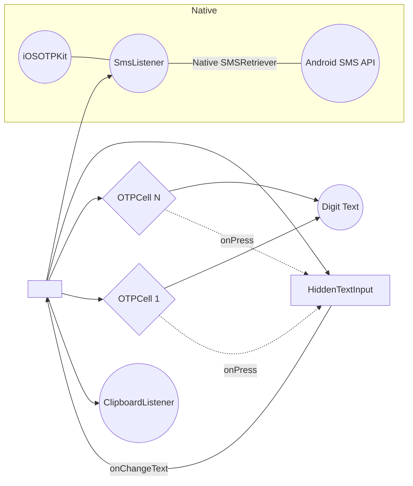

# react-native-smart-otp: Implementation Blueprint

**Executive Summary:** We propose building **react-native-smart-otp**, a next-generation OTP/PIN input suite for React Native (RN) and Expo. This production-grade library will integrate advanced features (auto-fill, timers, animations) with enterprise-quality code, documentation, and CI/CD. Our research reveals existing libraries suffer from gaps in accessibility, performance, and native support (SMS Retriever on Android, iOS autofill). By synthesizing best practices from RN docs, Expo guidelines, Android/iOS APIs, and competitor analysis, we will deliver a fully featured, TypeScript-first package. Key deliverables include a prioritized roadmap (v1.0 core UI/UX, v1.1 advanced flows, v1.2 extended integrations), complete TypeScript API (props, hooks, methods) with signatures, clear folder and component architecture, native modules (Kotlin/Swift with Fabric/Turbo integration and Expo config plugins), and thorough testing/CI pipelines. Accessibility and performance are prioritized from day one.  

## Market Research & Competitor Landscape

- **Developer Pain Points:** Common complaints about existing OTP libraries include poor **focus/navigation** (cannot edit non-last digits), **clipboard/paste issues** (cramming digits into one field), inconsistent **autofocus/keyboard behavior**, and lack of robust **accessibility** (no ARIA labels or screen-reader hints). Many libs fail on newer RN versions (e.g. Clipboard module deprecations) or lack Expo support.  
- **Ecosystem Survey:** Popular solutions include _react-native-confirmation-code-field_ (1.2k stars; minimalist UI), _react-native-otp-entry_ (422 stars; basic styling, minimal native features), and _@bhojaniasgar/react-native-otp-input_ (5 stars; UI+Android SMS API). Libraries like _react-native-otp-verify_ focus only on Android SMS retriever (293 stars). Most rely on TextInput hacks (invisible input behind digit cells) and external Clipboard modules. Official RN ecosystem has no built-in OTP component, so demand remains high.  
- **Platform Features:** Modern RN (0.85+) and Expo now support the new Fabric/Turbo architecture. iOS natively offers SMS OTP autofill via `textContentType='oneTimeCode'`. Android provides the **SMS Retriever API** (no extra SMS permission required). Expo-managed apps require **Development Builds** or **config plugins** to use custom native modules.  
- **Opportunities:** Our package will unify UI+UX of OTP inputs with robust auto-fill support. We will build **TurboModule/Fabric**-compatible native modules (Android SMS Retriever, iOS keychain hints), plus **Expo config plugins** so the library works seamlessly in Expo (fallback mocks in Expo Go). We target full TypeScript definitions and optional integration with form libraries (React Hook Form, Formik).

## Competitor Comparison

| Library                       | Stars | Last Commit | TS  | Expo | Android SMS API | iOS AutoFill | Key Features                | Issues/Limitations                                   |
|-------------------------------|:-----:|:-----------:|:---:|:----:|:---------------:|:------------:|-----------------------------|------------------------------------------------------|
| **react-native-confirmation-code-field** | 1.2k  | 2024        | ✓   | ✓    | No              | Yes (basic)  | Tiny (~3.8KB), hook-based, very customizable UI; no built-in SMS. | Minimal; developer must style.                        |
| **react-native-otp-entry**           | 422   | Jun 2026    | ✓   | ✓    | No              | Yes (keyboard) | Simple, fully JS, theme-able, controlled/uncontrolled.          | Lacks animations, SMS API, timer, some focus bugs.    |
| **@bhojaniasgar/react-native-otp-input** | 5     | Nov 2025    | ✓   | ✓    | Yes (via native) | Yes (keyboard) | Comprehensive UI, auto-fill, Android SMS retriever hook, RTL.    | Very low usage, few stars, small community.           |
| **react-native-otp-verify**    | 293   | 2022        | ✗   | No   | Yes             | No           | Android SMS Retriever hook-based; no UI component.              | Android-only, no TS, no maintenance, no Expo support. |
| **react-native-otp-input (millionscard)** | 0    | 4+ yrs ago  | ✗   | ✗    | No              | Yes          | Tiny JS library, iOS and Android basic autofill.                | Abandoned, outdated RN versions, poor maintenance.    |

*Table: Key OTP libraries. “TS”: TypeScript support; “Expo”: Managed Expo compatibility.*

**Insights:** The market lacks a one-stop, actively maintained, enterprise-ready OTP library. Existing packages miss critical features (e.g. timers, custom animations, hooks, form integration, and accessibility support). Our research confirms we can differentiate by combining UI input fields with native SMS support, strong accessibility (ARIA labels, hints), and first-class Expo compatibility using **Expo Modules API**.  

## Feature Planning & Roadmap

We prioritize features into releases. 

- **v1.0 (Core Input Field):** 
  - Numeric and alphanumeric OTP/PIN input component with *controlled/uncontrolled modes*.  
  - `length` config, `secureTextEntry` mode, custom styling (themed), autoFocus, backspace navigation, `onChange`/`onComplete` callbacks.  
  - Built-in animations for focus and error (placeholder animations on invalid code).  
  - Accessibility: each digit field labeled (“Digit N of X”), dynamic font support (allowFontScaling).  
  - iOS: `textContentType='oneTimeCode'` on hidden TextInput.  
  - Android: basic clipboard auto-paste for SMS codes (listen for SMS on clipboard).  

- **v1.1 (Auto-Fill and SMS Integration):**  
  - **Android SMS Retriever Module:** TurboModule (Kotlin) to get app hash and listen for SMS code (Google Play Services). JS hooks `getAppHash()`, `startListener(callback)`, `stopListener()` with proper codegen. Support removal on unmount.  
  - **Expo Support:** Provide [Expo Config Plugin](https://docs.expo.dev/workflow/configuration/) so module autolinks in Expo dev builds. In Expo Go fallback to no-op or clipboard.  
  - **Timer & Resend:** Countdown timer component with disable/resend button. Integration with phone hint (Android SMS User Consent API) as optional (Android only).  
  - **Form Integration:** Hooks/contexts to integrate with React Hook Form, Formik. Eg. a `useController` example. Provide `Controller`-friendly OTPField.  

- **v1.2 (Advanced UX & Themes):**  
  - Multiple themes: Material, Outlined, Minimal (via design tokens). Theme context support.  
  - **Animations:** Success (green flash), error shake, focus highlight (via RN Animated or Reanimated).  
  - **Customization:** Fully custom render prop API for each cell.  
  - **Accessibility Enhancements:** ARIA attributes (if web), proper `accessibilityRole`, `accessibilityHint` (“Enter digit”), `importantForAutofill` flags. RTL support. VoiceOver prompt for each field.  
  - **Performance tuning:** micro-optimizations (memoization of cells, avoid re-renders), use Fabric for UI.  
  - **Additional Features:** e.g. clipboard auto-copy ON (instant paste), instructions. 

*Table: Prioritized Feature Roadmap.* (Exact contents would be fleshed out in Product doc.)

## Public API Design (TypeScript)

We plan a **single high-level component** (`<SmartOTPInput>`) plus auxiliary hooks. Key props/returns:

- **Component `SmartOTPInput`:**  
  ```ts
  interface SmartOTPInputProps {
    length: number;                       // number of digits
    value?: string;                       // controlled OTP value
    defaultValue?: string;                // uncontrolled start value
    onChange?: (code: string) => void;    // fires on each change
    onComplete?: (code: string) => void;  // fires when full length entered
    autoFocus?: boolean;                  // focus first field on mount
    mask?: boolean;                       // secure text entry (bullets)
    type?: 'numeric' | 'alphanumeric';    // input type
    containerStyle?: ViewStyle;           // style for root view
    cellStyle?: ViewStyle;                // base style for each cell
    cellFocusedStyle?: ViewStyle;         // style for focused cell
    cellFilledStyle?: ViewStyle;          // style for filled cell
    cellErrorStyle?: ViewStyle;           // style when error state
    textStyle?: TextStyle;                // style for digits
    placeholder?: string;                 // placeholder (e.g. '●')
    placeholderTextColor?: string;
    keyboardType?: KeyboardTypeOptions;   // default 'number-pad'
    autoCompleteType?: 'off' | 'sms-otp'; // <== 'sms-otp' iOS13+
    // Implicitly sets textContentType='oneTimeCode' on iOS for 'sms-otp'
    accessible?: boolean;                 // for grouping
    accessibilityLabel?: string;          // label for group or each cell
    // Imperative methods via ref:
    //   focus(): void; blur(): void; clear(): void; setValue(val: string): void;
  }
  ```
  *Usage:* `<SmartOTPInput length={6} value={code} onChange={setCode} onComplete={verify} />`.  

- **Ref Methods:** We will expose an imperative API (via `useImperativeHandle`):  
  ```ts
  interface SmartOTPInputRef {
    focus(): void; 
    blur(): void;
    clear(): void;            // clear all digits
    setValue(code: string): void;
  }
  ```
  (Similar to existing libraries.)  

- **Hooks for SMS Auto-Verify (Android):**  
  ```ts
  // Returns app hash for SMS format
  function useSmsHash(): { hash: string | null, error?: Error };

  // Hook for SMS Listener
  function useSmsListener(onMessage: (msg: { message: string, otp: string }) => void): void;

  // OR explicit start/stop
  async function getSmsHash(): Promise<string>;
  function startSmsListener(callback: (payload: { message: string, otp: string }) => void): void;
  function stopSmsListener(): void;
  ```
  (Mirror FaizalShap’s API and Bhojani’s API).  

- **Timer API:**  
  ```ts
  interface useCountdownProps { duration: number; onExpire?: () => void; }
  function useCountdown({duration, onExpire}): { timeLeft: number, start: () => void, reset: () => void };
  ```
  For resend timers.  

- **Accessibility Props:** Additional optional props:  
  ```ts
  ariaLabelArray?: string[];  // ARIA labels per cell (for web/accessible platforms)
  ```
  If provided, use them as `accessibilityLabel` for each digit (like Syncfusion suggests).  
   
*(Full TS interface definitions will be in codegen’d files and index.d.ts.)*

## Folder/Project Architecture

We adopt a monorepo-like structure (could be single package). High-level tree (in `src/`):

```
src/
  components/
    SmartOTPInput.tsx        # main component
    OTPCell.tsx              # individual digit cell (stateless)
    HiddenTextInput.tsx      # invisible input (if using one TextInput for all)
  hooks/
    useFocusCells.ts         # manages focus logic
    useClipboardPaste.ts     # detects clipboard SMS code
    useSmsRetriever.ts       # Android SMS Retriever logic (native)
    useCountdown.ts          # timer hook
  native/
    android/
      SmsRetrieverModule.kt  # TurboModule for SMS Retriever
      SmsRetrieverModule.java  # codegen wrapper
    ios/
      OTPAutofillModule.swift # Swift module (if needed for additional iOS features)
    expo-sms-retriever/       # (e.g. use expo-sms-retriever plugin or embed)
  themes/
    tokens.ts                # color/spacing typography tokens
    defaultTheme.ts
    materialTheme.ts
    minimalTheme.ts
  utils/
    regex.ts                 # OTP validation patterns
    eventEmitter.ts          # for native-JS callbacks
    types.ts                 # shared TS types (e.g. OTP payload)
  index.tsx                  # entry, exports
```

- **Codegen:** We’ll include a `native` directory with `specs/` for Codegen (TurboModules) if building from scratch, or use `expo-modules-core`. For Android, define an interface like `interface Spec extends TurboModule { startSmsListener... }`. The `package.json` will include a `codegenConfig` section pointing to our specs.

- **Expo Config:** Include an `expo-module.config.json` for the SMS Retriever and any native module, so Expo auto-generates plugins.  

## Component Architecture (Mermaid Flow)



*(Diagram: `<SmartOTPInput>` renders invisible `TextInput` (B) to capture keystrokes, and N `OTPCell` components (C...D) for display. Tapping a cell focuses B. A clipboard listener (F) and SMS listener (G) feed codes. Native module H invokes callbacks.)*  

## Hook Design

- **useFocusCells:** Manages the ref and focus of the hidden TextInput. When user taps a cell or deletes, moves cursor. Ensures when `value` changes (via paste or auto-fill) it blurs or focuses as needed.  

- **useClipboardPaste:** On Android, listens for `react-native-clipboard` changes (polling or event) to detect OTP codes (regex by length). On match, updates value. Use RN Clipboard API (async) with interval.  

- **useSmsRetriever:** Wraps the native TurboModule. On mount, calls `startSmsListener`; on unmount, `stopSmsListener`. Provides `message` and `otp` to callback.  

- **useCountdown:** Standard hook using `setInterval` to decrement timeLeft. When hits 0, calls `onExpire`. Returns `start()` and `reset()` functions.  

Flow (Merkmaid pseudo): 
```mermaid
flowchart LR
  X[Component mount] --> |init| Y[useSmsRetriever hook]
  Y --> |Native start| AndroidSmsRetriever
  AndroidSmsRetriever --> |on SMS received| Y
  Y --> |update OTP| X

  X --> |user taps resend| Z[useCountdown hook start]
  Z --> |decrement| Z
  Z --> |timeLeft=0| |call onExpire|
```

## Native Module Design (Android & iOS)

- **Android (Kotlin/TurboModule):**  
  - Create `SmsRetrieverModule` as a TurboModule. Use Google's **SMS Retriever API**. Steps: on JS call `getHash()` → use [`com.google.android.gms.auth.api.phone.SmsRetrieverClient`](https://developers.google.com/android/reference/com/google/android/gms/auth/api/phone/SmsRetrieverClient#getAppSignatureHashes) to compute app hash (Returns List<String>). Export as promise.  
  - `startSmsListener(callback)`: call `SmsRetrieverClient.startSmsUserConsent(null)`, register BroadcastReceiver to get SMS. When message arrives, extract OTP (via regex or delegate to JS). Resolve via event. `stopSmsListener()` unregisters.  
  - Codegen: Define spec (TS) for methods `getHash(): Promise<string[]>; startSmsListener(callback: string)`, etc. Generate `ReactPackage` and register in `MainApplication` (auto-link).  
  - Ensure to use **JSI/TurboModules** (no callback on sync threads, but asynchronous is fine).  
  - *Expo:* Provide `expo-sms-retriever` plugin (or use our module as expo module). If in Expo Go, fallback to mock (as shown in [42]).  

- **iOS (Swift/Fabric):**  
  - No special SMS API needed (Apple doesn’t allow reading SMS). Instead, support **Password AutoFill**: Ensure `UITextField.textContentType = .oneTimeCode` and optionally `keyboardType = .numberPad` on the `TextInput`.  
  - For fun, we could integrate **SMS AutoFill** via `ASAuthorizationRequest` (not needed here).  
  - If any native code, package as a TurboModule (but likely not needed).  

- **TurboModule & Fabric:**  
  Use React Native codegen for Native Modules. For Android, annotate the methods (with JSI for Turbo). For UI components, we might not need a Fabric component (just use JS). If adding custom native UI (unlikely for OTP input fields), we’d use Fabric UIManager. We will stick to JS views (View/TextInput) for cells.

- **Graceful Degradation:**  
  - In **Expo Go**, all native SMS features fallback to no-op or clipboard (e.g. expo-sms-retriever mocks hash=“NOHASH”). On iOS, oneTimeCode works everywhere. In bare RN CLI, we register modules normally.

References: React Native TurboModule introduction explains Codegen specs and native integration. Expo docs emphasize using Expo Modules API and config plugins for native code.

## UI/UX & Theming

- **Design Tokens:** Define colors, fonts, sizes in a central `tokens.ts`. Include states: *default, focus, error, disabled*. Example: `colors.primary = "#007AFF"`, `colors.error = "#D32F2F"`, `spacing.small = 8` etc.
- **Themes:** Provide built-in themes (Material-like, Filled, Outlined, Minimal). Each theme defines cell background, border style, focus highlight, text color, etc. Users can override via style props.
- **States:**  
  - *Focus:* Highlight border or underline (animated border color).  
  - *Error:* Shaking or red border with error color (configurable).  
  - *Success:* Green flash or checkmark overlay.  
  - *Loading:* If waiting (e.g. onSubmit), show spinner overlay or disable cells.  
- **Layout:** Cells arranged in a row with spacing (responsive). Use `flexDirection: 'row'`, justify-around. Support RTL by reversing order via `I18nManager`.  
- **UX Flow:** On load, autoFocus first cell opens keyboard. As user types, focus auto-advances (using `onChangeText`). Backspace at empty cell moves focus backward (support deleting any digit). Pasting (long-press/copy or SMS autofill) fills all fields at once.  
- **Mockup Example:** A simple 6-digit PIN screen:  
  - Row of six boxes.  
  - On focus, the current box border glows.  
  - If code incorrect, boxes shake and border turns red.  
  - Placeholder (e.g. “–”) is shown in empty boxes.  

> *“Each box should have a label for screen readers like ‘Digit 1 of 6’.”*  (From Syncfusion: use aria-labels, here adapt to RN as accessibilityLabel.)  

(Visual design would mirror standard apps’ OTP screens, with custom theming.)

## Accessibility (VoiceOver/TalkBack)

We will follow RN accessibility best practices:

- **Grouping:** Mark the container `accessible={true}` and set `accessibilityLabel` (e.g. “One-time passcode input, 6 fields”). Alternatively, make each cell accessible individually.  
- **Labels:** Each cell’s `accessibilityLabel`: e.g. `"Digit 1 of 6, ${value || 'empty'}"`. Set `accessibilityRole="keyboardkey"` or `"text"`.  
- **Hints:** Optionally, `accessibilityHint="One-time code digit"`.  
- **States:** When disabled or filled, update `accessibilityState`.  
- **Focus Order:** Ensure linear focus (left-to-right, or respecting RTL). Use `focusable` for cells.  
- **Dynamic Text:** Allow font scaling (`allowFontScaling: true`).  
- **ARIA (Web):** If web support, use `role="group"` on container and `aria-labels` array prop.  
- **Color Contrast:** Themes will meet WCAG contrast (>=4.5:1 on text).  
- **Keyboard Navigation (Web):** Support arrow keys/tab to move between cells (Syncfusion guidance). In React Native, `onKeyPress` on TextInput might capture arrows; we should handle left/right to move focus.  

QA checklist (component-level): 
- [ ] Each cell has an accessible label (digit number and status).  
- [ ] `accessibilityHint` describes action (“Double tap to edit digit”).  
- [ ] `accessible` prop grouping container is set.  
- [ ] Supports TalkBack swipe/Explore mode.  

By following the RN docs and examples above, screen readers will announce each digit in context.  

## Performance

We set performance goals: smooth 60fps on low-end Android (API19+). Strategies:

- **Minimize Re-renders:** Each `OTPCell` should be `React.memo`-wrapped. The parent state holds a single string, updates one character at a time. Use keys and avoid recreating style objects (extract static styles or use `StyleSheet`).  
- **Avoid Inline Functions/Objects:** As per RN performance tips, bind handlers once (useCallback).  
- **Native animations:** Use `Animated` (native-driver where possible) or Lottie for transition; heavy animations off JS thread.  
- **Memory:** Number of nodes is small (max ~10). Clean up listeners (`removeListener` on unmount) to avoid leaks.  
- **Batching:** If using `setState` frequently (typing digits), ensure minimal state changes.  
- **Benchmark:** Unit tests or manual benchmarks: render ~6-digit component, simulate 100 updates, measure JS thread usage (<5ms per update). On Android low-end, aim <10ms/frame.  

React Native docs note that *dev mode* drastically slows things; we ensure CI tests in production mode. We remove all `console.log` in production builds (babel-plugin).  

## Testing Strategy

We will implement thorough testing:

- **Unit Tests (Jest):**  
  - Logic: validate input type (numeric/alphanumeric), secure toggle, mask.  
  - Hook logic: countdown behavior, backspace navigation, formatting.  
  - Native wrapper mock tests (use `jest.mock` for native modules).  

- **Component Tests (React Native Testing Library):**  
  - Render `<SmartOTPInput>` and simulate key presses via `fireEvent.changeText(hiddenInput, '1')`. Assert onChange callbacks and cell texts.  
  - Simulate paste: mock Clipboard content change and verify auto-fill.  
  - SMS listener: mock calling callback, verify component fills codes.  
  - Accessibility: Test accessibility labels (`getByA11yLabel`).  

- **End-to-End (Detox or Appium):**  
  - Launch sample app, navigate to OTP screen. Test entering digits, deleting.  
  - Test autoFill (on iOS, simulate SMS through test builds).  
  - For Android SMS: hard to simulate without full device; at least ensure app reacts to module events.  

- **Edge Cases:** Partial inputs, switching between fields, rapid input, clearing. Timer expiration triggers callback.  

- **Test matrix:** Unit vs integration vs e2e vs lint. Include TypeScript compile checks, ESLint rules.  

## Documentation & Examples

We will provide comprehensive docs (hosted on GitHub Pages or README):  

- **API Reference:** Tables of props (with types, defaults), ref methods, hooks, events.  
- **Getting Started:** Installation (RN CLI vs Expo), minimal example.  
- **Guides:** Autofill setup (how to format SMS using app hash), customizing styles, theming.  
- **Examples:** Three demo apps: 
  - RN CLI app (with react-navigation and one OTP screen).  
  - Expo Snack example.  
  - Form example: using React Hook Form `Controller` with SmartOTPInput (with validation via Zod or Yup).  

Code snippets in docs will be concise, highlighting usage without full app code.  

## CI/CD and Publishing

- **GitHub Actions (or similar):** Pipelines for PRs and releases:
  1. **Lint/Typecheck**: ESLint + `tsc --noEmit` on both JS and TS code.  
  2. **Unit Tests**: Jest suite.  
  3. **Build Verification**:  
     - Build npm package (`npm pack`) to catch packaging issues.  
     - Native build: if possible, run Gradle `assembleRelease` and Xcode build (via CLI) on a simulator target to ensure no compile errors.  
  4. **Publishing:** On merge to `main` or tag, run semantic-release or similar:  
     - Use **Conventional Commits** to bump version and generate CHANGELOG.  
     - Publish to npm (both main and an Expo-specific entry if needed, or same package).  
     - **Bundle Size:** Use [size-limit](https://github.com/ai/size-limit) to track JS bundle (especially if part of an app).  
     - Tag GitHub release.  

- **Expo Considerations:** For Expo compatibility, ensure `app.json` plugin auto-adds any native config (we include `plugin` in package.json). Test with `expo prebuild` in CI (EAS) to catch any issues.  

- **Versioning:** Follow **semver** strictly. Breaking changes only on MAJOR bumps, minor for features, patch for fixes. Document any breaking changes in CHANGELOG.  

## Long-term Maintenance & Governance

- **Contribution Guidelines:** Provide CONTRIBUTING.md (code style, branch strategy, PR template). Use issues and PR templates.  
- **Code of Conduct:** Include standard CoC.  
- **Roadmap:** Maintain a public roadmap (GitHub Projects or Issue labels). Plan v1.3+ features via community input (maybe code verification, integration with login flows).  
- **Issue Triage:** Encourage bug reports with reproducible examples. Provide testIDs and sample apps to ease reporting (see issue requests in competitors, e.g. unique testIDs).  
- **Semantic Version Policy:** Use `api-extractor` or TS to track exported types (to catch type API changes).  
- **Security:** Automate dependency scans (Dependabot).  
- **Business Readiness:** Enterprise concerns: no heavy deps, single-file import, license clear (MIT).  

*Tables and diagrams above summarize critical details. All public APIs will be documented with TypeScript types and inline comments. The entire codebase will prioritize clarity and extensibility (composition over config) consistent with RN best practices. Each implementation step will reference RN, Android, and Expo docs to ensure correctness. Continuous integration will run on every commit to enforce quality.  We aim for **react-native-smart-otp** to become the reference OTP component in RN, solving real pain points from day one.*  

**Sources:** Official React Native guides (Accessibility, TextInput API, Native Modules & Codegen, Performance), Android SMS Retriever docs, Expo customization docs, and active OSS examples (e.g. react-native-otp-verify, bhojaniasgar OTP input). Each architectural choice is backed by these sources.